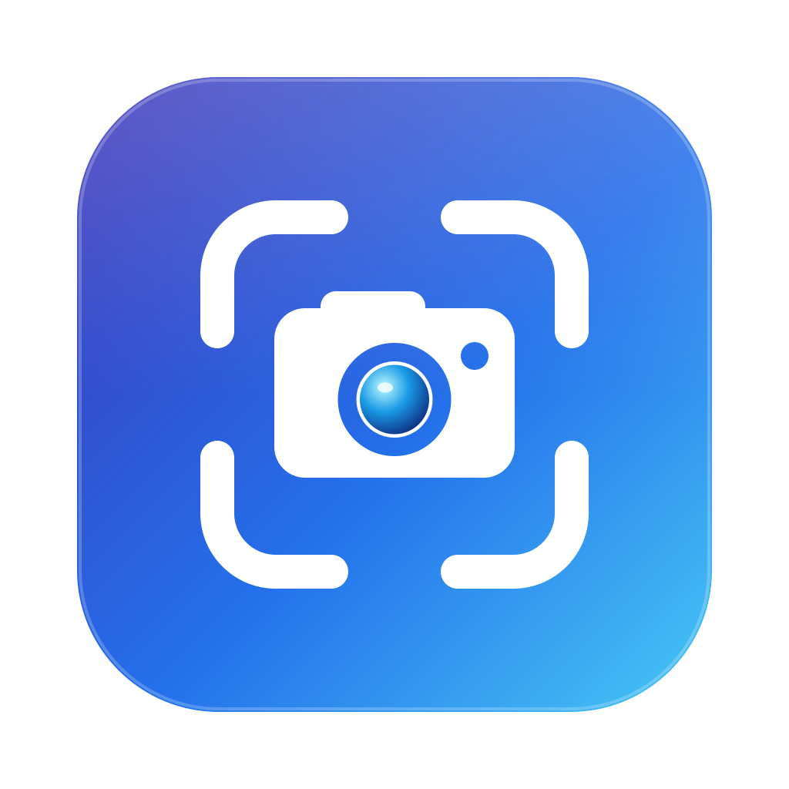

<p align="center">
  
</p>

<h1 align="center">Shotts</h1>

<p align="center">
  Screenshots for the Mac, in one motion.<br>
  <strong>F10 → select → annotate → copy → paste.</strong>
</p>

<p align="center">
  <a href="https://github.com/shreeve/shotts/releases/latest"></a>
  
  
  <a href="LICENSE"></a>
</p>

Shotts lives in the menu bar and does one thing well. Press F10 and a crosshair with a magnifier
follows the pointer over your screen, which goes on updating. Drag out the area you want, or click a window to capture just that
window. The capture opens in a small editor with arrows, callouts, text, shapes, a pen, a
highlighter, and pixelation for things that should not leave your Mac. Copy it, save it, print
it, or drag it into another app; the editor stays open like any window, and Option-F10 brings
back the last one if you closed it.

Press Command while you drag, so the selection turns red, and Shotts records the area instead, with the Mac's sound
and, if you like, your microphone. The menu bar shows the time; F10 stops it. The recording
opens in a window that saves it as an MP4 that plays nearly everywhere, or as an animated GIF
from Shotts' own encoder, at whatever size and frame rate you choose.

The annotations are made to look good on a busy screenshot: rounded strokes, tapered arrows,
bold text with a contrasting outline, restrained shadows. The app is small, keeps its memory in
check (one source image, a list of editable annotations, an undo history of edits rather than
pixels), and never captures anything you did not ask for.

## Install

```bash
brew install --cask shreeve/tap/shotts
```

Requires macOS 14 Sonoma or later on Apple silicon. Releases are signed with a Developer ID and notarized by
Apple. Installed copies update themselves: choose **Check for Updates…** in the menu bar menu.
The first capture asks for Screen Recording permission, once; the first recording with the
microphone on asks for the microphone.

Or download `Shotts-<version>.zip` from the [latest release](https://github.com/shreeve/shotts/releases/latest)
and open Shotts: it offers to move itself into Applications, where it can keep itself up to date.

## How it works

| Step | What happens |
| --- | --- |
| **Press F10** (fn-F10 on most Mac keyboards) | A crosshair follows the pointer over the live screen, with a magnifier that shows the pixels under it, their color in hex, and the selection's size. Command-C copies the color. |
| **Select** | Drag an area (Shift for a square, Space to move it), or click a window, outlined as the crosshair passes over it, to capture only that window, with the shadow macOS draws around it if you turn that on. Escape cancels. |
| **Annotate** | Arrow with text, arrow, line, text, rectangle, ellipse, pen, highlighter, obscure, and crop, each on a single key. Undo and redo. A color and style popover remembers your choices. |
| **Or record** | Press Command while dragging (the selection turns red), let go, press Return, and it records. Draw arrows and rectangles on it as it records; each fades after a few seconds. Pause when you like; F10 stops. Trim it, then save, copy, or drag it out as H.264 MP4 or a blue-noise-dithered GIF, as many ways as you like. |
| **Copy, save, print, drag** | Command-C puts the picture on the clipboard, Command-S saves a PNG, Command-P prints it to fit one page, and the hand icon drags a file into any app. Pictures keep the capture's resolution, so a Retina capture pastes at its on-screen size. |

The arrow with text is one object: draw the arrow, type beside its tail, and the words lay
themselves out on the side away from the tip. Move the arrow and the words come along; move the
words and the tail follows; move the head and the arrow reshapes.

Options in the menu bar menu: show the magnifier, dim outside the selection, include the window
shadow, copy to the clipboard the moment a capture is taken, and open each capture in a new
window.

## Command line

Turn on **Allow Command-Line Capture** in the menu bar menu, and `shotts` captures from scripts
and terminals (the Homebrew cask installs it; otherwise choose **Install Command-Line Tool…**):

```bash
shotts list                                        # windows and displays
shotts shot shot.png --window Safari               # a window, without its shadow
shotts shot a.png b.jpg --display 1 --delay 3
shotts record demo.mp4 demo.gif --window 4211 --duration 10s --width 800
shotts start --region 0,0,800,600 --json; …; shotts stop --json
```

`docs/SPEC.md` has every option, the JSON, and the exit codes.

## Building

```bash
swift build          # warnings are errors
swift test           # Core, then AppKit in windows that are never shown
open "$(Scripts/package-app.sh)"
```

`Scripts/package-app.sh` builds `Shotts.app` (debug unless `CONFIG=release`) and signs it with the
same Developer ID as releases: macOS ties the Screen Recording grant to the code signature, so a
stable signature keeps one grant across rebuilds. Without that certificate, `SIGN=-` signs ad hoc
(macOS then asks for Screen Recording again after each build), or `SIGN="<your identity>"` uses
your own. Debug builds also take developer switches for checking things by eye; `HANDOFF.md`
lists them.

## Documents

- [`docs/SPEC.md`](docs/SPEC.md): what the product does, key by key.
- [`HANDOFF.md`](HANDOFF.md): how the code does it, and the traps.
- [`AGENTS.md`](AGENTS.md): the rules for changing it.
- [`docs/RELEASING.md`](docs/RELEASING.md): how a release is signed, notarized, published, and updated.
- [`CHANGELOG.md`](CHANGELOG.md): what changed in each release.

## License

[MIT](LICENSE).
